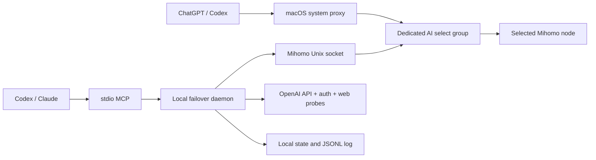

# Architecture

## Trust boundary

The daemon, CLI, and MCP server run as the current macOS user. The project uses
Mihomo's local Unix-domain controller socket and reads its secret from the
generated local Clash Verge config at runtime. No project component exposes a
remote listener.

The CLI and daemon are authoritative. Agent skills and MCP tools are adapters;
the failover policy does not depend on a model being available.

## Configuration sources

The generated `clash-verge.yaml` is read only to discover the mixed proxy port,
Unix controller socket, controller secret, DNS configuration, and live proxy
definitions used by the isolated scanner.

Persistent routing changes go through the selected profile's Clash Verge
Groups and Rules enhancement files referenced by `profiles.yaml`. Existing
enhancements are preserved. Writes are backed up, hash-checked, atomic, and
ordered so `profiles.yaml` is written last.

## Health state machine

1. Probe OpenAI API, OpenAI authentication, and ChatGPT web concurrently.
2. A valid API `401` JSON authentication response and valid auth OIDC issuer
   prove the required path.
3. Timeouts, TCP/TLS/DNS failures, resets, unsupported-region responses, or
   invalid required responses are hard failures.
4. Rate limits, transient upstream 5xx responses, access responses, and
   Cloudflare browser challenges are soft.
5. Before counting a hard failure, direct probes check whether the local
   network itself is down.
6. Failure streaks are tracked per probe target. Two consecutive rounds for the
   same target are required.
7. A successful or soft-only round resets the hard-failure streak.

Cloudflare challenges remain soft because command-line probes cannot prove the
interactive browser outcome. An explicitly user-verified login result can be
stored separately as browser feedback. It is bound to the observed exit IP,
ASN, and country, expires after a configured TTL, and affects candidate
eligibility/ranking only; it never increments a hard-failure streak or triggers
a switch.

At the default 10-second interval, candidate preflight, 3-second connection
wait, and verification keep the modeled first-failure-to-switch upper bound at
23 seconds for a passing first candidate.

## Candidate pools

- Active: target 12-16 recently verified nodes; preflight every 10 seconds.
- Warm: target 30-40 previously verified nodes; one rotating deep scan every
  5 minutes.
- Cold: remaining real proxy nodes; five rotating deep scans every 6 hours.

Pool size is constrained by available independent exits. Metadata, quota
notices, `DIRECT`, `REJECT`, and proxy groups are excluded. Deep scans launch a
temporary local-only Mihomo with an in-memory subset of proxy definitions, so
the live AI group does not move during inventory work.

Candidates are ranked by current preflight health, distinct exit IP, ASN
diversity, success history, cooldown/recovery state, stability, and only then
median latency. Duplicate exit IPs are removed from each attempt order.
An unexpired rejected browser fingerprint is excluded from all three failover
layers. A confirmed fingerprint is preferred among otherwise healthy,
independent candidates. Changing the observed fingerprint immediately makes
the old feedback inapplicable, so a dynamic exit can be evaluated again.

## Switching

The daemon preflights candidates by active, warm, then cold layer. After
selecting one candidate, it waits three seconds and closes only connections
whose hostname matches the configured AI suffixes and whose Mihomo chain still
contains the old node. It then repeats the real OpenAI route probes.

Only verified candidates complete a switch. A failed candidate is quarantined.
The old node is restored if no candidate verifies. Attempt budgets prevent
rapid cycling; a confirmed all-unavailable episode sends one notification and
enters backoff.

## Persistence and recovery

State is atomically stored after each decision. The selected node is never
proactively switched back while healthy. A failed node has a five-minute
initial cooldown and must accumulate recovery successes before it becomes a
normal candidate.

The LaunchAgent has `RunAtLoad` and `KeepAlive`, but contains no proxy
credentials. Uninstall moves its plist to Trash. Profile rollback restores the
latest backup and keeps newly created files in a recoverable backup location.
