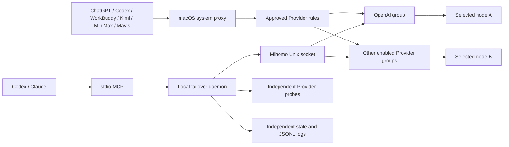

# Architecture

## Trust boundary

The daemon, CLI, and MCP server run as the current macOS user. The project uses
Mihomo's local Unix-domain controller socket and reads its secret from the
generated local Clash Verge config at runtime. No project component exposes a
remote listener.

The CLI and daemon are authoritative. Agent skills and MCP tools are adapters;
the failover policy does not depend on a model being available.

## Provider isolation

The public package defines conservative Provider templates. OpenAI is enabled
by default; WorkBuddy (China), Kimi, MiniMax, and Mavis are disabled until a
local overlay enables them. Each enabled Provider resolves to its own group,
state file, pool history, cooldowns, outage episode, switch history, and log.
The subscription node catalog is the only shared input.

The LaunchAgent supervises one state-machine thread per enabled Provider.
Starts are staggered. Background isolated deep scans use a process-wide
semaphore, so only one Provider performs that heavier maintenance work at a
time. Foreground failure confirmation remains Provider-local.

## Configuration sources

The generated `clash-verge.yaml` is read only to discover the mixed proxy port,
Unix controller socket, controller secret, DNS configuration, and live proxy
definitions used by the isolated scanner.

Persistent routing changes go through the selected profile's Clash Verge
Groups and Rules enhancement files referenced by `profiles.yaml`. Existing
enhancements are preserved. Writes are backed up, hash-checked, atomic, and
ordered so `profiles.yaml` is written last.

`config.yaml` contains public/base profiles. Optional machine-specific
adaptation lives in mode-`0600` `providers.local.yaml`. It can enable a profile,
add reviewed exact domains, and add validated probes without copying those
observations into the publishable config. Loading merges the overlay in memory;
rewriting the base config deliberately strips overlay-derived values.

Local discovery samples Mihomo `/connections` and exposes only normalized
hostnames, process basenames, evidence class, and counts. It never exposes URL
paths, connection IDs, remote IPs, chains, credentials, or full inventories.
Temporal-only browser observations are never auto-recommended, and shared
infrastructure cannot become a generated critical probe.

## Health state machine

1. Probe the selected Provider's configured required targets concurrently.
   OpenAI uses API, authentication, ChatGPT web, and ChatGPT WebSocket
   transport; other public templates begin with a conservative product-root
   web probe and must be locally adapted before reliance.
2. For OpenAI, a valid API `401` JSON authentication response and valid auth
   OIDC issuer prove the required path. Generic probes use explicit accepted
   statuses and optional reviewed hard statuses/body markers.
3. Timeouts, TCP/TLS/DNS failures, resets, unsupported-region responses, or
   invalid required responses are hard failures.
4. Rate limits, transient upstream 5xx responses, access responses, and
   Cloudflare browser challenges are soft. An exact ChatGPT challenge is
   `browser_ambiguous` and remains candidate-eligible only when API,
   authentication, and WebSocket transport are all healthy. Other soft
   combinations are `soft_unstable` and are not candidates.
5. Before counting a hard failure, direct probes check whether the local
   network itself is down.
6. Within a round, only probes classified hard are retried once after one
   second. A recovered retry makes that target non-hard; healthy and soft
   probes are not repeated.
7. Two aggregate hard-failure rounds, separated by at least eight seconds, are
   required. The failing critical target may differ between rounds because the
   decision represents route failure, not a target-specific counter.
8. The first hard-failure round immediately starts isolated candidate
   preparation. A successful, soft-only, direct-network-down, or
   controller-down round resets confirmation and cannot trigger switching.

Cloudflare challenges and generic access responses remain soft because command-line probes cannot prove the
interactive browser outcome. An explicitly user-verified login result can be
stored separately as browser feedback. It is bound to the observed exit IP,
ASN, and country, expires after a configured TTL, and affects candidate
eligibility/ranking only; it never increments a hard-failure streak or triggers
a switch.

Candidate preparation runs in parallel with the eight-second failure
confirmation gap. For already prepared independent candidates whose live
acceptance is retry-free, the modeled upper bound is 19 seconds from the first
verified failure for candidate one and 30 seconds for candidate two, including
the just-in-time preflight, connection wait, and live verification. A mandatory
reverification for an unstable-looking candidate, or a cold rescue scan, is
deliberately not promised this latency bound.

## Candidate pools

Every enabled Provider maintains the following pools independently:

- Active: target 12-16 recently verified independent exits; a rotating batch of
  four gets light preflight every 10 seconds and two get a full-path scan every
  2 minutes.
- Warm: target 30-40 previously verified independent exits; rotating
  full-path batches of two every 5 minutes.
- Cold: remaining real proxy nodes; rotating full-path batches of four every
  6 hours.
- Refill: when active or warm is below target, two cold candidates are scanned
  every 60 seconds instead of waiting for the normal cold cycle.

That Provider's maintenance scans pause during its hard-failure confirmation, switching, and
the 60-second probation period. This prevents inventory work from competing
with the foreground health decision.

Pool size is constrained by available independent exits. Metadata, quota
notices, `DIRECT`, `REJECT`, and proxy groups are excluded. Deep scans launch a
temporary local-only Mihomo with an in-memory subset of proxy definitions, so
the live AI group does not move during inventory work.

Candidates are ranked by full-path eligibility, recent success rate, distinct
exit IP, ASN diversity, cooldown/recovery state, stability, and only then
median latency. Duplicate exit IPs are removed from each attempt order. A
candidate requires two eligible full-path samples in a 120-second window,
separated by at least five seconds, with the newest sample no older than 30
seconds. A light Mihomo delay probe alone never clears recovery or proves
candidate eligibility.
An unexpired rejected browser fingerprint is excluded from all three failover
layers. A confirmed fingerprint is preferred among otherwise healthy,
independent candidates. Changing the observed fingerprint immediately makes
the old feedback inapplicable, so a dynamic exit can be evaluated again.

## Switching

The daemon prepares bounded candidates by active, warm, then cold layer without
moving the live AI group. Immediately before selection, it reruns a two-second
Mihomo live-core preflight; stale candidates are quarantined without touching
the group. After selecting one that passes, it waits three seconds and repeats
the real Provider route probes through the live group. Two usable candidate
samples are required and at least one must be retry-free. If the live acceptance
round recovers a hard target on retry, the daemon waits three seconds and runs a
mandatory second round. That second round must pass retry-free; otherwise the
candidate is quarantined and the old selection is immediately restored without
closing connections. A clean first round or clean mandatory follow-up commits
the switch, starts a 60-second probation period, and closes only connections
whose hostname matches that Provider's approved suffixes/exact domains and
whose chains do not contain the new node. This preserves ordinary traffic,
other Providers, and already-correct connections.

The failure episode records attempted nodes and exit fingerprints, so it does
not bounce between duplicate exits. Three independent candidates are prepared
in parallel and at most two are live-selected per failover transaction. A
commit transaction reuses up to two already prepared candidates instead of
blocking to refill the preparation target after the second failure round. A
failed just-in-time preflight never moves the live group and does not consume
the live-selection budget. Remaining untried exits cause a short
candidate-retry backoff, not a false all-unavailable declaration. Only
exhaustion of every eligible independent exit confirms the outage, sends one
notification, and enters the longer backoff.

Provider state deduplicates the all-unavailable notification for its entire
outage episode. A small shared, credential-free local gate also suppresses the
same `当前机场全部不可用` Toast when several Provider state machines confirm
the airport-wide failure at nearly the same time.

## Persistence and recovery

State is atomically stored after each decision. The selected node is never
proactively switched back while healthy. A failed node has a five-minute
initial cooldown and must accumulate recovery successes before it becomes a
normal candidate.

Candidate evidence is tagged with a signature of the live IPv6, DNS, and hosts
semantics copied into the isolated scanner. A path change invalidates old
eligibility evidence so candidates are revalidated under the new stack.

The LaunchAgent has `RunAtLoad` and `KeepAlive`, but contains no proxy
credentials. Uninstall moves its plist to Trash. Profile rollback restores the
latest backup and keeps newly created files in a recoverable backup location.
